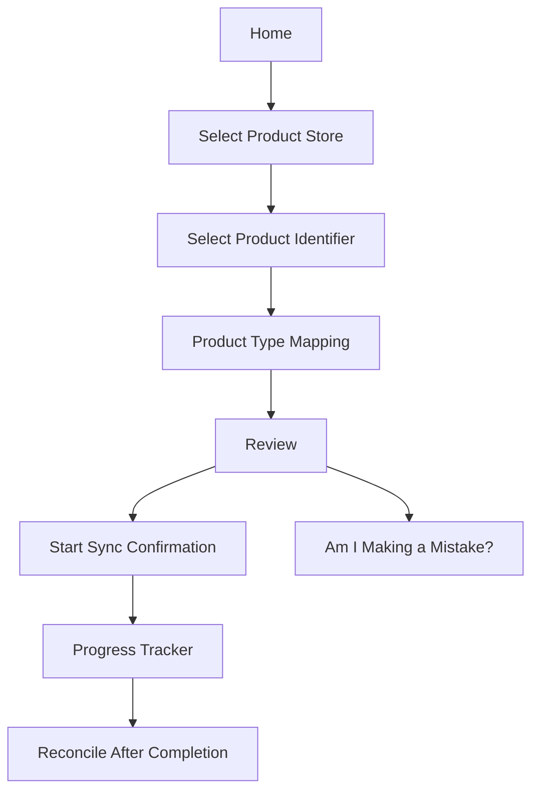

# Shopify Product Sync First-Time Wizard

## Purpose

This document captures the feature set, screen logic, and implementation plan for the first-time Shopify product sync wizard shown in Figma. The goal is to turn the current placeholder product sync page into a guided, first-run setup flow that:

- validates the Shopify shop to Product Store relationship before import
- confirms the product identifier strategy before any data is synced
- verifies product type mapping readiness
- adds a safety review before the first import starts
- exposes sync progress using backend system-message state
- ends with a reconcile and completion state

## Source Material

- Approved Figma file: `HC Ionic design system`
- Home: [node 53855:7752](https://www.figma.com/design/bVPRRw282CqGKMdbz7dciH/HC-Ionic-design-system?node-id=53855-7752&m=dev)
- Select product store: [node 53857:47647](https://www.figma.com/design/bVPRRw282CqGKMdbz7dciH/HC-Ionic-design-system?node-id=53857-47647&m=dev)
- Select product identifier: [node 53858:50348](https://www.figma.com/design/bVPRRw282CqGKMdbz7dciH/HC-Ionic-design-system?node-id=53858-50348&m=dev)
- Product type mapping: [node 53860:50954](https://www.figma.com/design/bVPRRw282CqGKMdbz7dciH/HC-Ionic-design-system?node-id=53860-50954&m=dev)
- Review: [node 53860:51618](https://www.figma.com/design/bVPRRw282CqGKMdbz7dciH/HC-Ionic-design-system?node-id=53860-51618&m=dev)
- "Am I making a mistake?" modal: [node 53860:52850](https://www.figma.com/design/bVPRRw282CqGKMdbz7dciH/HC-Ionic-design-system?node-id=53860-52850&m=dev)
- Start product sync confirmation modal: [node 53860:53126](https://www.figma.com/design/bVPRRw282CqGKMdbz7dciH/HC-Ionic-design-system?node-id=53860-53126&m=dev)
- Progress tracker: [node 53860:53496](https://www.figma.com/design/bVPRRw282CqGKMdbz7dciH/HC-Ionic-design-system?node-id=53860-53496&m=dev)
- Reconcile after completion: [node 53862:57699](https://www.figma.com/design/bVPRRw282CqGKMdbz7dciH/HC-Ionic-design-system?node-id=53862-57699&m=dev)
- Backend reference PR: [saastechacademy/foundation#168](https://github.com/saastechacademy/foundation/pull/168)

## UX Summary

The wizard is a staged setup flow that uses a persistent summary card on the left and a detail panel on the right.

- The left card acts as a compact step tracker.
- The right panel changes based on the current setup stage.
- The flow starts as a "first-time setup" experience and later transitions into import progress and reconcile screens.
- The review and confirmation steps explicitly frame the import as high-risk and irreversible.

## Step Inventory

| Screen | Purpose | Primary user action | Completion gate |
| --- | --- | --- | --- |
| Home | Introduce first-time sync and show setup checklist | `Review configurations` | User enters the wizard |
| Select product store | Choose and validate the OMS Product Store | `Next` | Product Store selected and multi-shop verification checkbox checked |
| Select product identifier | Confirm internal name / primary identifier strategy | `Next` | Identifier selected or inherited/locked from existing Product Store |
| Product type mapping | Placeholder readiness step for v1 | `Finish configuration` | No hard gate in v1 |
| Review | Compare Shopify and OMS state before starting import | `Run product import` | Review completed and preflight confirmations passed |
| Mistake modal | Run a targeted sanity check before import | Close modal | Informational safety check |
| Start sync modal | Final destructive-action confirmation | `Start product sync` | Confirmation checkbox checked |
| Progress tracker | Show backend sync lifecycle and current status | `Reconcile product sync` | Initial import finishes |
| Reconcile after completion | Compare expected vs actual final state | Leave page | Import complete and post-sync checks available |

## Wizard Flow



## Screen-by-Screen Feature Set

### 1. Home

The first screen is a lightweight entry state, not a form.

- It introduces the first-time import and explains that configuration must be checked before sync starts.
- It shows a four-row summary card:
  - Product store
  - Internal name mapping
  - Product types
  - Start product import
- It exposes one clear action: `Review configurations`.

Implementation logic:

- Show this state only when the Shopify shop has not yet linked any products in OMS.
- The summary card should be data-backed, not static:
  - Product store value from the linked Shopify shop
  - Internal name mapping value from the linked Product Store identifier
  - Product types count from Shopify type mappings
- The first-run condition should come from backend truth, using "shop has linked OMS products" as the lock and completion signal.

### 2. Select Product Store

This step validates the most dangerous relationship in the flow: which Product Store the Shopify shop will import into.

- The user selects one Product Store from a list.
- Each row can show supporting metadata such as:
  - number of connected Shopify shops
  - whether a connected shop is new/the one that the user is currently setting up
  - created date
- The lower section lists related Shopify stores already attached to the selected Product Store.
- That lower section only renders when the selected Product Store already has connected shops. It should stay hidden when the current shop would be the first shop linked to that Product Store.
- The warning copy makes the rule explicit: only shops that represent the same catalog should share a Product Store.
- The user must explicitly check a verification checkbox before continuing.

Implementation logic:

- Default to the existing linked `shop.productStoreId` when present.
- If the shop is not yet linked, allow selection from available Product Stores.
- If the Shopify shop already has any OMS-linked products, the Product Store selection is locked and rendered read-only.
- Persist the selection only after confirmation, or keep it as draft wizard state until the user advances.
- The verification checkbox is a hard gate and should reset whenever the selected Product Store changes.

Data requirements:

- list of Product Stores
- current Product Store linked to the shop
- related Shopify shops already connected to the selected Product Store
- shop-created metadata and "new shop" labeling

### 3. Select Product Identifier

This step confirms the identifier used to uniquely match products for the import.

- The UI presents one primary identifier choice at a time.
- The Figma copy emphasizes that internal name consistency matters across shops connected to the same Product Store.
- The supported choices in the design are:
  - SKU
  - UPCA / Barcode
  - Shopify internal id
- The screen repeats the connected-shop context so the user understands this decision affects more than one shop.
- The design also shows a locked-state explanation when the identifier can no longer be changed.

Implementation logic:

- Persist the value to `productStore.productIdentifierEnumId`.
- If the Shopify shop already has any OMS-linked products, the identifier choice is locked and rendered as informational.
- Use the same Product Store context from the previous step instead of refetching an unrelated dataset.

Data requirements:

- product identifier enum list from `SHOP_PROD_IDENTITY`
- selected Product Store details
- rule input indicating whether the identifier is mutable
- related Shopify shops for explanatory context

### 4. Product Type Mapping

This step remains intentionally lightweight in v1 and should be treated as a dummy readiness state until the detailed mapping experience is finalized.

- The summary card on the left now shows resolved identifier state.
- The right panel focuses on product type mapping readiness.
- The visual suggests a compact list of Shopify types that need review or mapping confirmation.
- The main action is `Finish configuration`.

Implementation logic:

- Reuse the existing Shopify product type mapping model instead of inventing a new one.
- Do not add complex completeness or skip logic in v1.
- The first implementation can render this as an informational placeholder state that transitions the user into review.
- If a mapping UI is embedded later, it should remain inside the same product sync page state machine rather than branching into a new route.

Data requirements:

- Shopify product types detected for the current shop
- current `SHOPIFY_PRODUCT_TYPE` mappings
- optional future mapping completeness rule

### 5. Review

The review screen is a preflight risk assessment, not just a final confirmation.

- The left summary card shows the full configuration state.
- The right side compares:
  - live Shopify stats
  - current Product Store / HotWax counts
- The design shows large number cards for variants and products.
- It also shows the number of products already linked to the selected Product Store.
- It exposes two safety actions:
  - `Am I making a mistake?`
  - `Run product import`

Implementation logic:

- Fetch live Shopify counts directly for the selected shop before import begins.
- Fetch OMS counts for the selected Product Store so the user sees whether they are about to merge into an existing catalog.
- Disable the final import action until all prerequisite data has loaded.
- Route the `Run product import` action through the final confirmation modal instead of triggering the import directly.

Data requirements:

- live Shopify product count
- live Shopify variant count
- current OMS product count for the Product Store
- current OMS variant count for the Product Store
- linked-shop count for the Product Store

### 5a. "Am I Making a Mistake?" Modal

This modal is a targeted sanity check.

- It summarizes whether the expected number of products was found.
- It lists cross-check rows with a matched status.
- The copy implies a preflight comparison between the selected Shopify dataset and the Product Store's existing product identity space.

Implementation logic:

- This should be driven by a dedicated preflight endpoint or worker, not by client-side heuristic guessing.
- The modal should support matched, missing, duplicate, and conflicting states even if the current Figma only shows matched rows.
- Thresholds from the current review notes:
  - if fewer than 5 out of 10 sampled products match, show a warning state and require explicit confirmation to proceed
  - if at least 7 out of 10 sampled products match, show a passive warning only
  - for the intermediate 5 to 6 out of 10 band, default to the safer warning-plus-confirmation behavior until product defines a narrower rule

Data requirements:

- expected Shopify product set
- Product Store-side comparison result
- per-item match status and summary counts

### 5b. Start Product Sync Confirmation Modal

This is the last explicit warning before import starts.

- It states that the first product sync cannot be cancelled.
- It warns that incorrect Shopify store to Product Store mapping can corrupt catalog state.
- It requires a checkbox confirmation before the primary action becomes valid.

Implementation logic:

- The import start action should not fire directly from the review screen.
- The modal confirmation is the real submit boundary.
- On confirm, transition into the progress tracker and create the backend sync job.

### 6. Progress Tracker

This screen maps directly to the backend import lifecycle.

- The left card becomes a sync-step tracker:
  - Request product export from Shopify
  - Process export request in Shopify
  - Process exported file from Shopify
  - Complete
- The right side shows detailed operational cards:
  - request payload status
  - current Shopify bulk operation
  - pending bulk operations
  - bulk file processing state
- The CTA changes to `Reconcile product sync`.

Implementation logic:
- This screen should poll backend sync state and render backend status, not frontend-derived assumptions.
- It should support queued, sent, running, waiting, completed, cancelled, and error conditions.
- The screen should preserve traceability by surfacing identifiers such as bulk operation id where useful.

### 7. Reconcile After Completion

This screen is the post-import verification state.

- It reuses the progress summary on the left.
- It reuses the live-vs-OMS comparison cards on the right.
- It adds completion messaging:
  - product sync setup complete
  - background sync already runs automatically every 15 minutes for Shopify
- The linked-to-shop count should now reflect the new connection state after import.

Implementation logic:

- This screen should not appear until the initial import and backend persistence complete successfully.
- It should confirm the final catalog state and communicate that scheduled background sync is already enabled by default.
- The completion state should be durable and derive from backend sync records.

## Backend Lifecycle Mapping

The foundation PR documents the backend as a seven-stage flow. The wizard should map to that lifecycle rather than inventing separate frontend-only statuses.

| Backend stage | Backend meaning | Most relevant UI |
| --- | --- | --- |
| 1. Queuing the request | Create outgoing system message with filters and dates | Start import confirmation, early progress state |
| 2. Sending to Shopify | Enforce single bulk operation lock and send GraphQL mutation | Progress tracker |
| 3. Confirming bulk operation | Polling/webhook marks bulk op complete and stores result URL | Progress tracker |
| 4. Data preparation | Convert JSONL to nested JSON and upload to MDM | Progress tracker |
| 5. Diff computation | Compare incoming data with ProductUpdateHistory | Mostly backend, implicit in progress |
| 6. Database updates | Selectively create/update product data | Mostly backend, implicit in progress |
| 7. Saving history | Persist new hashes, snapshots, and difference map | Completion / reconcile |

### Backend Status Semantics Worth Surfacing

- `SmsgProduced`: request queued
- `SmsgSent`: request sent to Shopify and bulk op lock acquired
- `SmsgConfirmed`: operation completed successfully
- `SmsgCancelled`: operation cancelled
- `SmsgError`: operation failed

### Important Backend Constraints

- Shopify allows only one bulk operation at a time per shop group, so the UI should expect queued waiting states.
- Completion can be driven by polling or webhook, so the frontend should poll a consolidated status surface instead of trying to track Shopify state directly.
- The backend uses history snapshots and diff computation, so post-import reconcile should reflect that the first sync establishes the baseline for later incremental syncs.

## Current Company App Fit

### Already present in the app

- Route shell for `/shopify-connection-details/:id/product-sync`
- Shopify shop lookup via `shopify/getShopById`
- Product Store lookup and update flows
- product identifier enum fetch via `util/fetchProductIdentifiers`
- Product Store identifier persistence via `ProductStoreService.updateProductStore`
- Product type mapping CRUD via Shopify type mapping services
- existing Shopify product types page that can inform the mapping step

### Not yet present and likely needed

- first-run completion and lock state derived from whether the shop already has OMS-linked products
- Product Store candidate list with related Shopify shop metadata
- identifier mutability rule based on whether the shop already has OMS-linked products
- live Shopify product and variant stats endpoint
- Product Store product and variant stats endpoint tailored for this wizard
- preflight "am I making a mistake?" comparison endpoint
- import start endpoint that queues the first sync
- sync progress endpoint backed by system-message and bulk-operation state
- reconcile/completion endpoint or aggregated view model

## Recommended Frontend State Model

The frontend should use one wizard view model that keeps draft setup data separate from persisted data until the right commit boundary.

Suggested state shape:

```ts
type ProductSyncWizardStep =
  | "home"
  | "product-store"
  | "identifier"
  | "product-types"
  | "review"
  | "progress"
  | "reconcile";

type ProductSyncWizardState = {
  shopId: string;
  currentStep: ProductSyncWizardStep;
  shopHasOmsLinkedProducts: boolean;
  selectedProductStoreId?: string;
  selectedIdentifierEnumId?: string;
  productStoreLocked: boolean;
  identifierLocked: boolean;
  productTypeMappingsComplete: boolean;
  productStoreVerified: boolean;
  reviewReady: boolean;
  importStarted: boolean;
  syncSessionId?: string;
};
```

Recommended behavior:

- Keep wizard state in a dedicated local view model or Vuex module while the user is configuring.
- Persist Product Store and identifier choices at explicit step boundaries, not on every intermediate click.
- Switch from setup mode to progress mode only after the start-sync confirmation succeeds.
- Replace the temporary local-storage first-run logic with backend-backed "shop has OMS-linked products" logic.
- Do not add separate routes for each wizard step. Keep the entire flow inside the current product sync page and advance it with a state machine.

## Recommended Implementation Phases

### Phase 1: Documentation and shell

- keep the existing product sync route
- replace the placeholder dashboard with a real wizard shell
- implement step navigation and summary card state using mock data

### Phase 2: Reuse existing configuration surfaces

- wire Product Store selection using current Product Store services
- wire identifier selection using current product identifier enums and Product Store update path
- wire product type mapping using current Shopify mapping APIs

### Phase 3: Add preflight and review data

- fetch live Shopify stats
- fetch Product Store-side stats
- add the mistake-check modal data source

### Phase 4: Add import lifecycle integration

- start initial product import through backend queueing
- poll or subscribe to consolidated progress state
- render progress tracker from backend lifecycle

### Phase 5: Add reconcile and completion

- show final counts after first import completes
- replace temporary first-run detection with backend truth
- communicate default background-sync behavior

## Implementation Notes for Later UI Work

- Keep the wizard aligned to core Ionic building blocks: toolbar, cards, list items, toggles, radios, checkboxes, buttons, and modals.
- Avoid introducing custom layout CSS as part of the first implementation pass.
- Treat the left summary card as a reusable wizard summary component.
- Treat review, progress, and reconcile as separate states even if they share some stat cards.
- Do not add new routes for each step of the wizard. Update the current product sync page using the state machine.
